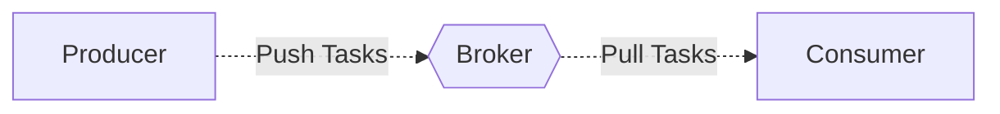

# Single Producer-Consumer

We will start with a simple Consumer-Producer pattern to understand how it feels to work with `sergeant`


## Graph




## Code

=== "consumer.py"
    ```python
    import sergeant
    import logging


    class Worker(
        sergeant.worker.Worker,
    ):
        config = sergeant.config.WorkerConfig(
            name='test_worker',
            connector=sergeant.config.Connector(
                type='redis',
                params={
                    'nodes': [
                        {
                            'host': 'localhost',
                            'port': 6379,
                            'password': None,
                            'database': 0,
                        },
                    ],
                },
            ),
            logging=sergeant.config.Logging(
                level=logging.INFO,
                log_to_stdout=True,
            ),
        )

        def work(
            self,
            task,
        ):
            self.logger.info(f'Task parameters are: {task.kwargs}.')
    ```

=== "producer.py"
    ```python
    import consumer


    worker = consumer.Worker()
    worker.init_broker()
    worker.purge_tasks()
    worker.push_task(
        kwargs={
            'some_parameter': 'one',
        },
    )
    ```


## Explanation

### Consumer

At the class definition, we inherit from `sergeant.worker.Worker` to gain all the `Worker` class abilities. In order for this worker to be able to produce and consume tasks, we need to define `config` attribute and `work` method.

Defining the `config` class attribute, allow us to config our worker's abilities. The worker config is a `dataclass` named `sergeant.config.WorkerConfig` which has multiple child dataclasses. There are two mandatory fields: `name` which defines the worker's name, and the queue name within the broker, and the second is the `connector`. The connector is the device that is responsible to talk with the broker. In this example we define a `test_worker` worker with a `redis` connector.
`logging` helps to configure the logger.

For each consumed task, the `work` method is invoked. The parameters are passed inside the `task` argument as the key `kwargs`.

### Producer

The producer first loads the consumer module. The reason for that is that once instantiating a `Worker`, you can use its configuration. The producer uses the `Worker` instance so it will have a connection to the broker.

Later, we call to `init_broker` so we will create the connection to the task queue inside the Worker instance. We call `purge_tasks` to assure no leftover tasks exist in the queue.
`push_task` is the function that compose a task object, and pushes it to the queue.


## Execution

=== "Producer"
    ```shell
    python3 producer.py
    ```

=== "Consumer"
    ```shell
    python3 -m sergeant.supervisor \
        --worker-module=consumer \
        --worker-class=Worker \
        --concurrent-worker=1
    ```
