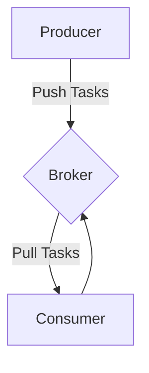

# Single Producer-Consumer

We'll start with a simple Consumer-Producer pattern to gain an understanding of how to work with `sergeant`


## Graph




## Code

=== "consumer.py"
    ```python
    import sergeant
    import logging


    class Worker(
        sergeant.worker.Worker,
    ):
        def generate_config(
            self,
        ):
            return sergeant.config.WorkerConfig(
                name='test_worker',
                connector=sergeant.config.Connector(
                    type='redis',
                    params={
                        'nodes': [
                            {
                                'host': 'localhost',
                                'port': 6379,
                                'password': None,
                                'database': 0,
                            },
                        ],
                    },
                ),
                logging=sergeant.config.Logging(
                    level=logging.INFO,
                    log_to_stdout=True,
                ),
            )

        def work(
            self,
            task,
        ):
            self.logger.info(f'task parameters are: {task.kwargs}')
    ```

=== "producer.py"
    ```python
    import consumer


    worker = consumer.Worker()
    worker.init_broker()
    worker.purge_tasks()
    worker.push_task(
        kwargs={
            'some_parameter': 'one',
        },
    )
    ```


## Explanation

### Consumer

In the class definition, we inherit from `sergeant.worker.Worker` to gain all the abilities of the `Worker` class. To make this worker capable of producing and consuming tasks, we must define the `generate_config` method and the `work` method.

Defining the `generate_config` class method allows us to configure our worker's abilities. Worker config is a `dataclass` named `sergeant.config.WorkerConfig` that has multiple child dataclasses. There are two mandatory fields: `name` which defines the worker's name and the queue name within the broker, and `connector`. The connector is responsible for communicating with the broker. The following example shows how to define a worker with a "redis" connector.
`Logging` facilitates the configuration of the logger.

Each consumed task is handled by the `work` method. Within the `task` argument, the parameters are passed as the key `kwargs`.

### Producer

The producer loads the consumer module first. The reason is that once a `Worker` has been instantiated, its configuration can be used. Since the producer uses the `Worker` instance, it will have a connection to the broker.

After that, we call `init_broker` to create a connection to the Worker instance's task queue. To ensure there are no leftover tasks in the queue, we call `purge_tasks`.
`push_task` composes a task object, and pushes it to the queue.


## Execution

=== "Producer"
    ```shell
    python3 producer.py
    ```

=== "Consumer"
    ```shell
    python3 -m sergeant.supervisor \
        --worker-module=consumer \
        --worker-class=Worker \
        --concurrent-worker=1
    ```
