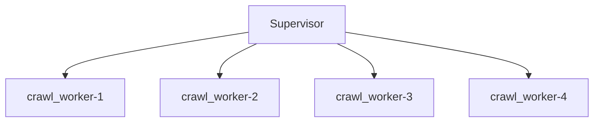

# Supervisor

The `Supervisor` is in charge of spawning new workers, and respawning them when they exit. It is also responsible for handling their errors. The supervisor is capable of restricting worker's memory usage to eliminate memory exhaustion.

- `concurrent-workers` - How many subprocesses the supervisor should spawn and supervise.
- `worker-module` - The worker module in a dotted notation path.
- `worker-class` - The worker class name inside the module file - usually `Worker`.
- `max-worker-memory-usage` [optional] - How much RSS memory in bytes a subprocess-worker can use before the supervisor terminates it and respawn a new one instead.
- `logger` [optional - programatically only] - One can supply a custom logger to pipe all the supervisor logs to this logger.


## Command Line

```shell
python3 -m sergeant.supervisor --helpusage: supervisor.py [-h] --concurrent-workers CONCURRENT_WORKERS
                     --worker-class WORKER_CLASS --worker-module WORKER_MODULE
                     [--max-worker-memory-usage MAX_WORKER_MEMORY_USAGE]

Sergeant Supervisor

optional arguments:
  -h, --help            show this help message and exit
  --concurrent-workers CONCURRENT_WORKERS
                        Number of subprocesses to open
  --worker-class WORKER_CLASS
                        Class name of the worker to spawn
  --worker-module WORKER_MODULE
                        Module of the worker class
  --max-worker-memory-usage MAX_WORKER_MEMORY_USAGE
                        Maximum RSS memory usage in bytes of an individual
                        worker. When a worker reaches this value, the
                        supevisor would kill it and respawn another one in
                        place.

```


### Examples

Assuming a `Supervisor` with concurrency level of 4
```shell
python3 -m sergeant.supervisor \
    --worker-module=crawl_worker \
    --worker-class=Worker \
    --concurrent-worker=4
```



When a worker reaches its end of life - at the moment it finished `max_tasks_per_run` tasks, it will exit, and a new worker will be created by the supervisor.


## Programatically

It is possilbe to programatically invoke a `Supervisor` if you would like to document your supervisor parameters or if you would like to attach another logger.


### Examples

Pay attention to the `worker_module_name` parameter. The way python find the module name depends on the command line CWD. Look at `benchmark/1_simple_worker/sergeant/supervisor.py` to see how to work with module names if the supervisor.py file lays aside the worker module.

```python
import sergeant


def main():
    supervisor = sergeant.supervisor.Supervisor(
        worker_module_name='consumer',
        worker_class_name='Worker',
        concurrent_workers=1,
        max_worker_memory_usage=None,
    )
    supervisor.start()


if __name__ == '__main__':
    main()
```
