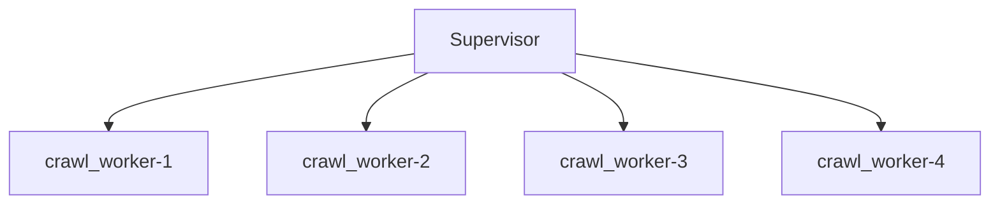

# Supervisor

The `Supervisor` is responsible for spawning and respawning workers. The Supervisor is also responsible for dealing with errors. Supervisors can restrict a worker's memory usage in order to prevent memory exhaustion.

- `concurrent-workers` - The number of subprocesses that should be spawned and supervised by the supervisor.
- `worker-module` - The worker module in a dotted notation path.
- `worker-class` - The class name in the module file, usually `Worker`.
- `max-worker-memory-usage` [optional] - How much RSS memory in bytes a subprocess-worker can utilize before the supervisor terminates it and respawns a new one.
- `logger` [optional - programmatically only] - One can supply a custom logger to send all supervisor logs to.


## Command Line

```shell
python3 -m sergeant.supervisor --help
usage: supervisor.py [-h] --concurrent-workers CONCURRENT_WORKERS
                     --worker-class WORKER_CLASS --worker-module WORKER_MODULE
                     [--max-worker-memory-usage MAX_WORKER_MEMORY_USAGE]

Sergeant Supervisor

optional arguments:
  -h, --help            show this help message and exit
  --concurrent-workers CONCURRENT_WORKERS
                        Number of subprocesses to open
  --worker-class WORKER_CLASS
                        Class name of the worker to spawn
  --worker-module WORKER_MODULE
                        Module of the worker class
  --max-worker-memory-usage MAX_WORKER_MEMORY_USAGE
                        Maximum RSS memory usage in bytes of an individual
                        worker. When a worker reaches this value, the
                        supevisor would kill it and respawn another one in
                        place.

```


### Examples

Assuming a `Supervisor` with concurrency level of 4
```shell
python3 -m sergeant.supervisor \
    --worker-module=crawl_worker \
    --worker-class=Worker \
    --concurrent-workers=4
```



The worker reaches its end of life once it has completed `max_tasks_per_run` tasks. `Supervisor` will create a new worker in place.


## Programatically

It is possilbe to programatically invoke a `Supervisor` if you would like to document your supervisor parameters or if you would like to attach another logger.


### Examples

Be sure to pay attention to the `worker_module_name` parameter. Depending on the command line CWD, Python determines the module name. Look at `benchmark/1_simple_worker/sergeant/supervisor.py` to see how to work with module names when the 'supervisor.py' file is in the same folder as the worker module.

```python
import sergeant.supervisor


def main():
    supervisor = sergeant.supervisor.Supervisor(
        worker_module_name='consumer',
        worker_class_name='Worker',
        concurrent_workers=1,
        max_worker_memory_usage=None,
    )
    supervisor.start()


if __name__ == '__main__':
    main()
```
