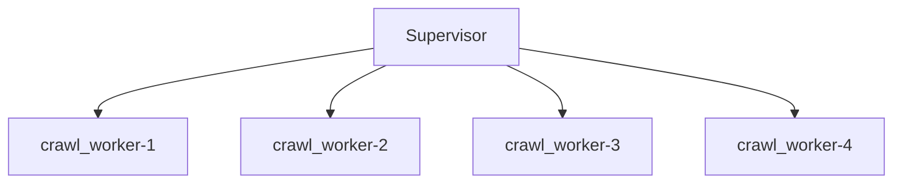

# Supervisor

The supervisor is the main application that take the `Worker` class and supervise it.


## Command Line

```shell
python3 -m sergeant.supervisor --helpusage: supervisor.py [-h] --concurrent-workers CONCURRENT_WORKERS
                     --worker-class WORKER_CLASS --worker-module WORKER_MODULE
                     [--max-worker-memory-usage MAX_WORKER_MEMORY_USAGE]

Sergeant Supervisor

optional arguments:
  -h, --help            show this help message and exit
  --concurrent-workers CONCURRENT_WORKERS
                        Number of subprocesses to open
  --worker-class WORKER_CLASS
                        Class name of the worker to spawn
  --worker-module WORKER_MODULE
                        Module of the worker class
  --max-worker-memory-usage MAX_WORKER_MEMORY_USAGE
                        Maximum RSS memory usage in bytes of an individual
                        worker. When a worker reaches this value, the
                        supevisor would kill it and respawn another one in
                        place.

```

- `concurrent-workers` - How many subprocesses the supervisor should spawn and supervise.
- `worker-module` - The worker module in a dotted notation path.
- `worker-class` - The worker class name inside the module file - usually `Worker`.
- `max-worker-memory-usage` [optional] - How much RSS memory in bytes a subprocess-worker can use before the supervisor terminates it and respawn a new one instead.

# Examples

Assuming a `Supervisor` with concurrency level of 4
```shell
python3 -m sergeant.supervisor \
    --worker-module=crawl_worker \
    --worker-class=Worker \
    --concurrent-worker=4
```



When a worker reaches its end of life - at the moment it finished `max_tasks_per_run` tasks, it will exit, and a new worker will be created by the supervisor.
